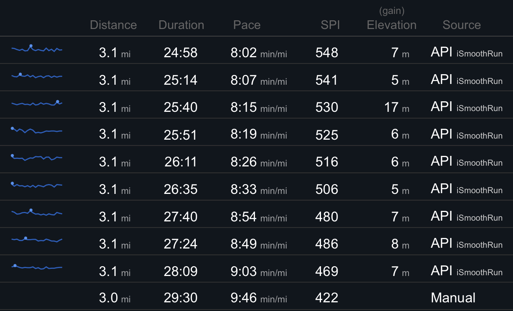

# Updates

## Latest:
### I run like a gamer
I hate to say it, but it's unfortunately true. All this month, I have been tracking my runs using some new software and it has brought this ugly reality to my attention. [iSmoothRun](https://apps.apple.com/us/app/ismoothrun/id410965399) isn't an app designed to "gameify" exercise or anything, but it does feature an automated voice that gives me constant updates on my run progress, including how far ahead of a set pace I am. As it turns out, hearing intermittently about a number I can make get bigger by running faster has been the key to me upping my pace all this time.

The results speak for themselves.

As a bonus (and actually the reason I tried it to begin with), iSmoothRun is very flexible and can sync with basically any running/fitness services you can think of. The image above is from [SmashRun](https://smashrun.com/) and all I have to do it tap a button in iSmoothRun to sync a very detailed log over there.

Theoretically, I actually don't have to tap anything for runs to be sent to SmashRun or anywhere else, as the app touts the ability to auto-sync runs once they finish. But this is where my only issue with iSmoothRun rears its head. For whatever reason, the app crashes when I finish a run. It saves things just fine for me to sync after the fact, but nothing syncs automatically and my runs end with no fanfare from the app or even an indication that I've finished. Luckily, I have only been running a set course so far this year so I basically know where the finish line is from memory.

Unluckily, I'm now cursed with this realization that my game-diseased brain loves making numbers go up so much that it actually makes me run faster. In other words, I run like a gamer.

Permalink: [https://smallscreen.info/blog/posts/2023/01/25/I-run-like-a-gamer](https://smallscreen.info/blog/posts/2023/01/25/I-run-like-a-gamer)

## Other Posts:

Regrettably, this is the first post.